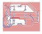

# Modulo Puente H

Este módulo se encarga de controlar los motores a partir de las entradas recibidas por sus pines.

Las pistas azules representan conexiones físicas cableadas por nosotros ya que el diseño no es posible en una placa simple faz.

 

## TODOs
 - [ ] Revisar las medidas de la placa
 - [ ] Hacer los agujeros para las medidas del modelo 3D
 - [ ] El regulador de tensión debería ir en este módulo?
 - [ ] Revisar las conexiones
 - [ ] Replantearse el diseño del puente h, ¿Qué tensión tienen los motores?

#### Nota

Considerar que se podría diseñar todo en la parte posterior y soldar los componentes del lado que no tiene cobre.
