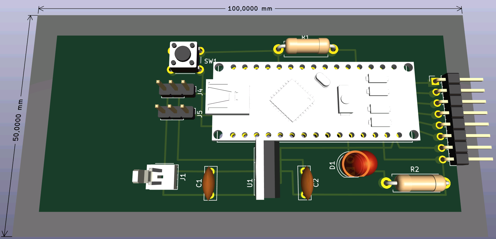
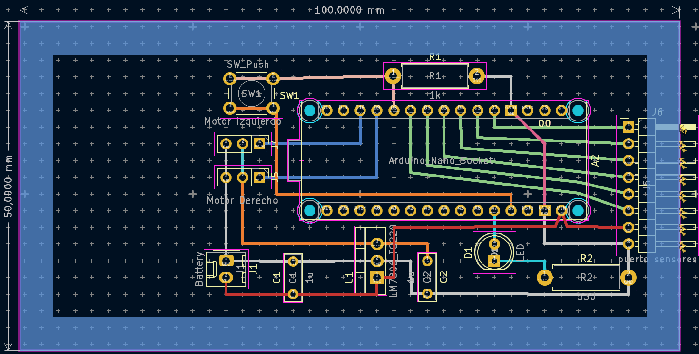

# Modulo Seguidor

Este módulo se encarga de ejecutar las funciones propias de un seguidor de línea, procesar las lecturas del módulo sensor y dirigir los motores.

Vista previa de la placa desde arriba

## Referencia

Para el diseño en kicad se realizó una configuración para editar la placa como si se editara una placa perforada.

Las marcas de cruces representan los agujeros de la placa perforada.
Las zonas sombreadas en los bordes tienen 5mm de ancho y representan la parte que no tiene agujeros en la placa perforada.
Si no se puede acomodar el componente se presiona CTRL mientras se arrastra para hacer un ajuste fino.

Más información al respecto en [foro de arduino](https://forum.arduino.cc/t/perfboard-circuit-design-with-kicad/1283999)

## TODOs
 - ~~Revisar las medidas de la placa (tomar en cuenta los bordes de la placa que no tienen agujeros)~~
 - Revisar los footprints de las resistencias y de los capacitores
 - ~~Acomodar los componentes y hacer las conexiones~~
 - Exportar a un modelo 3D (opcional)
