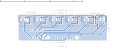

# Modulo de sensores

Este módulo se encarga de la lectura de la línea.

[comment]: Hacer_alguna_descripción_más

Vista previa de la PCB desde arriba

Vista previa de la PCB desde abajo

## TODOs
En orden de prioridad
- ~~Automatizar exportar los archivos de fabricación~~
- Hacer las pistas más grandes si es posible
- El script debe exportar a PDF ambos lados en la misma hoja conservando las dimensiones para imprimir el circuito.
- ~~Exportar a otros formatos (SVG, STEP, etc)~~
- Agregar alguna compatibilidad para Windows(?
- Agregar algun check para el momento de subir a Github
- Tal vez agregar algunas opciones para controlar el script(?
- Cambiar las rutas relativas con alguna variable de entorno(?
