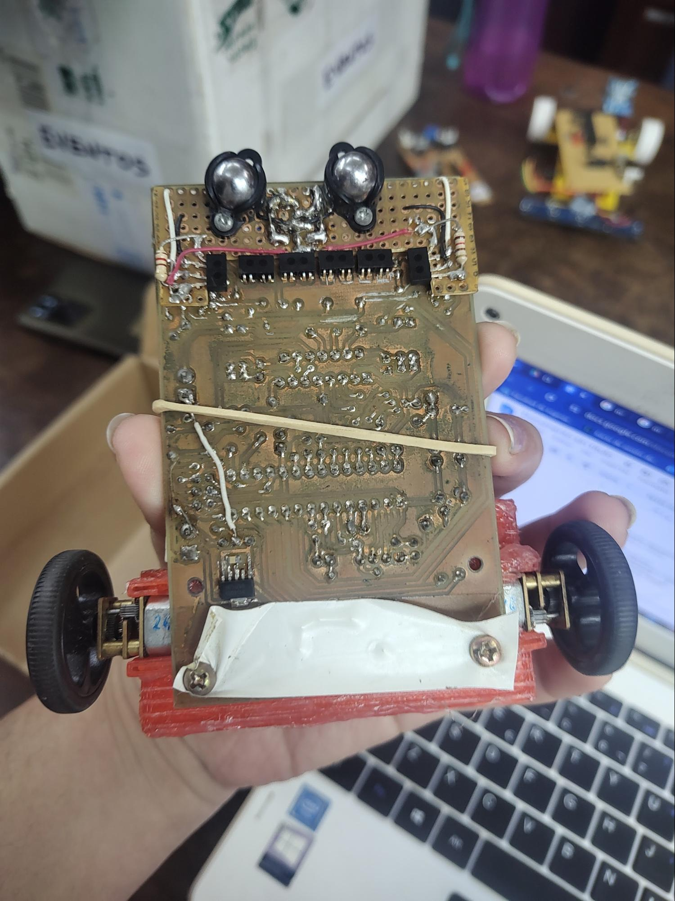

## Links sobre distintos seguidores de linea 

https://youtu.be/CcIQNCyfTVk

https://tecnopatafisica.com/tecno3eso/teoria/robotica/105-arduino-robot-siguelineas

https://www.taloselectronics.com/blogs/tutoriales/robot-seguidor-de-linea-para-arduino-codigo

Referencia de internet

Un seguidor de línea del LABI
 

Otro más
 

## Código

https://www.youtube.com/watch?v=w3bE3ygJMx8

## Puente H

Cómo usar un driver L298N

https://youtu.be/c0L4gNKwjRw?si=vZ1mv0ccFuuH0b-6

Esquemático de un driver genérico con L298N

https://newscrewdriver.com/2021/01/28/circuit-schematic-of-generic-l298n-driver-board/

